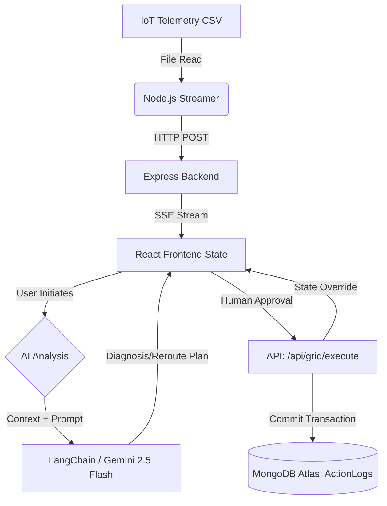

# LuminaGrid: Engineering Documentation

## 1. Executive Summary

### Problem Statement
Modern SCADA systems and solar grid management dashboards suffer from overwhelming information density. Operators are inundated with raw telemetry streams, leading to cognitive fatigue, delayed incident response, and high costs associated with reactive grid maintenance. Without proactive reasoning over this data, critical anomalies such as sensor dropouts, hardware degradation, or weather-induced efficiency drops go unnoticed until total failure.

### Proposed Solution: LuminaGrid
LuminaGrid is a premium, AI-driven Solar PV management platform built to intercept cognitive overload. By integrating continuous telemetry processing with native, low-latency Generative AI models (LangChain + Gemini 2.5 Flash), the system proactively diagnoses anomalies, alerts operators to external factors (like weather events), and formulates executable remediation strategies—all within a pristine, Apple Pro-inspired glassmorphism interface.

### Target Stakeholders
- **Grid Operators**: To efficiently execute load-balancing and isolation commands.
- **Maintenance Engineers**: To leverage contextual AI diagnosis for degraded units.
- **Operations Managers**: To access immutable audit trails of all system interventions via MongoDB.

---

## 2. High-Level System Architecture

LuminaGrid utilizes a bifurcated execution model where real-time streaming data operates concurrently with asynchronous AI reasoning and Human-in-the-Loop (HITL) action logging. 

- **Data Ingestion (Node.js)**: A background streaming script simulates IoT sensors by parsing localized CSV data, forwarding it to a Node.js Express backend.
- **Telemetry Streaming**: An SSE (Server-Sent Events) endpoint establishes a unidirectional, persistent pipeline to the Vite React frontend.
- **Frontend State**: React dynamically processes this stream, enforcing rules (like LKGV) before updating the DOM.
- **AI Integration**: The frontend interfaces with backend RAG and LangChain endpoints, parsing the telemetry context into Gemini 2.5 Flash for rapid situational analysis.
- **Action Execution**: All operator commands (e.g., Isolate Unit, Reroute) are asynchronously persisted to an `ActionLogs` collection in MongoDB Atlas for rigorous auditing.

---

## 3. Data Flow Architecture (Mermaid)



---

## 4. Core Engineering & Edge Cases

### Last Known Good Value (LKGV) Logic
IoT sensors are notorious for brief communication dropouts, resulting in `0` or `null` values that create jarring UI flickering and false alarms. 
LuminaGrid intercepts this at the SSE `onmessage` handler. The incoming array is mapped against the previous React state (`prevData`). If a unit reports `0 kW` unexpectedly (and is not flagged as intentionally isolated), the frontend gracefully falls back to the unit's last known power output and status. This guarantees a stable interface during transient network blips.

### Map-Based Telemetry Array Deduplication
Due to the high-velocity nature of SSE streams, chunk overlaps occasionally cause duplicated unit records, resulting in React rendering errors (`Encountered two children with the same key`). To solve this, LuminaGrid utilizes a highly performant `Map` structure during the state update. The system iterates over the incoming stream and maps units by their unique `id`. This unconditionally overrides any trailing duplicates in the same chunk before converting `Array.from(mergedMap.values())`, guaranteeing absolute data integrity without sacrificing parsing speed.

### State Override Mechanism
When an operator issues a critical intervention (e.g., isolating a compromised inverter), the system must immediately and permanently reflect this, regardless of incoming sensor data.
We implemented a React `useRef` tied to an `isolatedUnits` array. When a unit is successfully logged as isolated in MongoDB, its ID is appended to this reference. The LKGV logic checks this reference *first*; if a unit is isolated, it forcibly overrides the unit's telemetry to `0 kW` and sets the status to `Isolated`, discarding the live SSE stream for that specific node.

### Graceful AI API Fallbacks (Handling 503 Overloads)
Enterprise-scale inference models occasionally suffer from heavy traffic, leading to 503 Service Unavailable errors. Instead of failing silently or crashing the UI, LuminaGrid wraps GenAI controller invocations in resilient try-catch blocks. If a 503 occurs, the backend intercepts it and returns a standard JSON payload with a dedicated `error` status and localized message. The frontend catches this and gracefully renders a "Connection Error: Could not reach AI Assistant" notice directly within the Diagnosis Modal, retaining the user's workflow stability.

---

## 5. Compliance Model (HITL & Audit Trails)

LuminaGrid strictly adheres to a **Human-in-the-Loop (HITL)** philosophy. The AI does not have autonomous execution authority.

1. **Reasoning**: The AI formulates strategies (e.g., rerouting 500kW to a Backup Battery due to rain).
2. **Intentional Friction (isConfirming State)**: Before any critical command is executed, the UI enters an `isConfirmingAction` state. This prevents accidental misclicks by rendering an explicit warning overlay (e.g., "Are you sure you want to isolate Unit 12? This manipulation directly affects grid distribution variables.")
3. **Approval**: The operator actively acknowledges the risk and reviews the proposed action via the confirmation overlay.
4. **Batch Execution & Audit**: Upon approval, the frontend triggers `POST /api/grid/executeBatchActions`. The AI Co-Pilot generates a precise JSON payload indicating split actions based on unit status (e.g., `[{ unitId: 'Unit 12', action: 'isolate' }, { unitId: 'Unit 15', action: 'reroute' }]`). The backend dynamically parses this array, writing immutable transaction records to MongoDB (using `insertMany`) to establish a robust compliance trail for all grid interventions.

### Strict AI Override Rule
To prevent false-positive "safe" diagnoses during actual emergencies (e.g., the AI attributing 0 kW power to nighttime or cloud cover), the system LangChain prompt injects a **Strict Override Rule**. This rule mandates that if a unit's telemetry indicates a `Critical` status, the AI must immediately prioritize hardware failure over environmental data and recommend immediate Isolation. This prevents catastrophic cascading failures by enforcing physical status hierarchies.


## 6. Technical Limitations & Production Roadmap (ADL & ODL Perspective)

### Current Architecture (Prototype Limitations)
In evaluating the enterprise data pipeline, LuminaGrid currently implements a highly optimized **Operational Data Layer (ODL)** but intentionally bypasses a traditional **Analytical Data Layer (ADL)**.
- **Micro-ODL & ODS**: The real-time SSE stream paired with React's in-memory state acts as our volatile ODL, providing sub-second latency for operators. The MongoDB `ActionLogs` collection serves as our lightweight Operational Data Store (ODS) specifically for immutable transaction auditing.
- **The AI Analytics Bypass**: We currently do not persist millions of rows of historical telemetry into a traditional ADL (like a Data Warehouse). Instead, LuminaGrid performs "On-the-Fly Analytics" by injecting the current operational context directly into Gemini 2.5 Flash via LangChain. The LLM acts as the analytical reasoning engine without the overhead of massive data storage.
- **Data Ingestion**: The current telemetry is driven by a mock CSV streamer and relies on dynamic IP whitelisting for MongoDB Atlas access, which is suitable for prototyping but not production.

### Future Scalability Roadmap
To transition LuminaGrid from a functional prototype to a fully deployable enterprise asset, the following architectural upgrades are planned:
1. **IoT Protocol Migration**: Replace the Node.js CSV streamer with a native publish-subscribe message broker (e.g., **MQTT** or **Apache Kafka**) for robust, fault-tolerant telemetry ingestion from actual physical inverters.
2. **True ADL Integration**: Implement a time-series database or cloud data warehouse (e.g., **Google BigQuery**) to construct a formal ADL. This will allow the system to train predictive machine learning models on historical weather and degradation patterns, further enhancing the AI Co-Pilot's accuracy.
## 7. Project Directory Architecture

Following our zero-downtime structural refactor, LuminaGrid utilizes a strict MVC backend and a Feature/Component frontend architecture.

### Directory Tree
```text
luminagrid/
├── server/                 # Node.js Backend API
│   ├── server.js           # Entry point and Express middleware setup
│   ├── routes/             # API Route Definitions
│   │   └── api.js
│   ├── controllers/        # Business Logic Controllers
│   │   ├── telemetryController.js
│   │   ├── aiController.js
│   │   └── gridController.js
│   └── services/           # Shared Services (DB, AI Clients)
│       ├── db.js
│       └── ai.js
│
├── src/                    # Vite React Frontend
│   ├── App.tsx             # Main Layout & State Orchestrator
│   ├── main.tsx            # React DOM Entry
│   ├── types.ts            # TypeScript Interfaces
│   ├── index.css           # Tailwind CSS
│   ├── hooks/              # Custom State Hooks
│   │   └── useTelemetry.ts # EventSource & LKGV logic
│   └── components/         # Modular Reusable UI components
│       └── ui/
│           ├── UnitCard.tsx
│           ├── MetricCard.tsx
│           ├── SkeletonCard.tsx
│           ├── LoadingOverlay.tsx
│           ├── Tooltip.tsx
│           └── Toast.tsx
```

### Separation of Concerns
1. **Backend MVC**: By isolating MongoDB (`db.js`) and GoogleGenAI (`ai.js`) into the `services/` layer, our controllers are completely decoupled from external client instantiations. `server.js` is strictly an orchestrator.
2. **Frontend Component Architecture**: Pure presentation logic (like the `UnitCard` and `MetricCard`) is decoupled into `src/components/ui`. They receive data strictly via props.
3. **State Integrity**: To ensure the Last Known Good Value (LKGV) stream isn't broken by excessive React re-renders, the SSE `EventSource` connection is cleanly encapsulated within `useTelemetry.ts`, securely managing the `isolatedUnitsRef` injection pattern.
